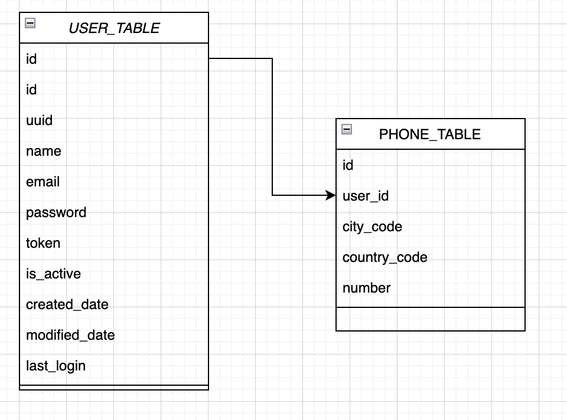

# nisum-challenge


## Requerimientos

Para construir y ejecutar la aplicación necesita lo siguiente:

- [JDK 17](https://www.oracle.com/java/technologies/downloads/#java17)
- [Maven 3](https://maven.apache.org)
- [Spring Boot 3.1.0](http://projects.spring.io/spring-boot/)

## Ejecutar la aplicación localmente

Para levantar la aplicación puede ejecutar el siguiente comando en el directorio raíz del proyecto:

```shell
mvn spring-boot:run
```

## Ejecutar pruebas en el endpoint registro de usuario

Para registrar un usuario puede ejecutar el siguiente comando en la terminal o en su defecto utilizar el collection de postman adjunto en el directorio [/assets](assets)

```shell
curl --location 'localhost:8080/api/users' \
--header 'Content-Type: application/json' \
--data-raw '{
    "name": "Some Username",
    "email": "username@domain.com",
    "password": "Admin$123",
    "phones": [
        {
            "number": "999888777",
            "cityCode": "1",
            "countryCode": "+51"
        }
    ]
}'
```

## Estructura de tablas

